加密协议逆向
================

加密数据破解工具
------------------

查壳工具--Peid
***************

  Peid，FileInfo，FFI等

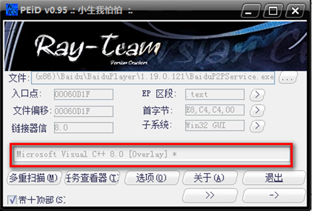

脱壳工具
*********

  如Waspack，aspack, Upx或者手动脱壳

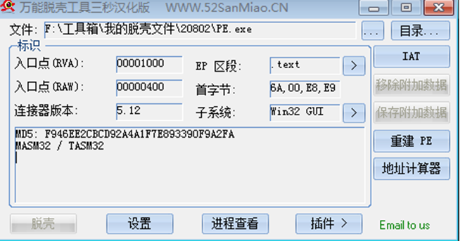

反汇编工具
**************

  Ollydbg,WinDbg为动态反汇编跟踪工具，Ida为应用程序静态分析工具，Ida和Hexray软件配合使用可以获得汇编语言伪代码。

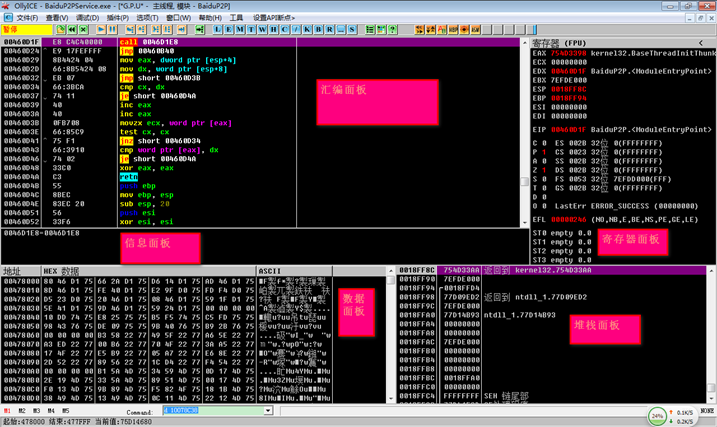

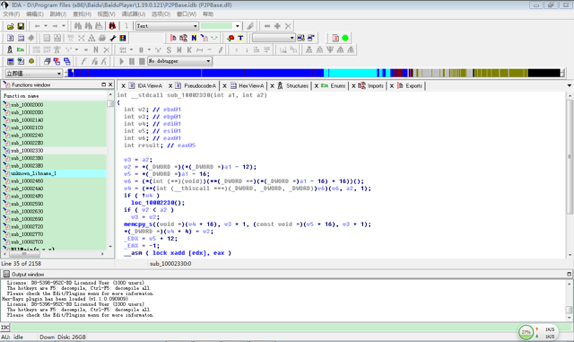

加密数据解析步骤
----------------

* 查壳

  利用Peid查看软件是否加壳，如果没有加壳则直接进入软件跟踪其数据请求交换过程，否则需要使用工具或手工脱壳，然后再进行跟踪分析。

＊ 动态和静态调试

        使用Ollydgb(WinDbg)加载软件并设置数据包接收和发送断点，当找到接收或发送的
    数据后进行单步跟踪，同时结合Ida工具查看函数伪代码，最终找到数据传输的加解密算法。

* 编写代码

  将算法写成代码对原始数据解密并对明文信息进行分析，最终提取关键特征或关键信息。
  写出wireshark插件

实例讲解
---------

* 本次以百度影音为例进行讲解，通过反汇编跟踪找到百度影音的解密算法如下，详细跟踪过程见下文。

* 百度影音解密算法描述

    * 密钥生成过程
       程序启动时，将生成秘钥放着全局变量KEY中
    * 解密过程：
       根据KEY与对应未知进行异或

查壳
****

    首先我们利用Peid工具进行查壳，可以看到此软件利用Vc开发工具进行开发并未加壳。

OD动态调试
***********

    打开OllyDbg软件选择文件附加然后选择如下红色标记的BaiduP2PService进程，并点击附加按钮

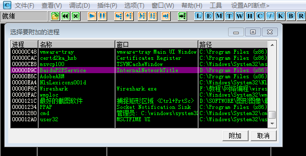

设置接收数据函数断点，然后按F9运行，此时程序会运行到接收数据函数处，如下图所示
recvfrom

接着按快捷键接收数据，并设置内存访问断点然后跟踪这个接收数

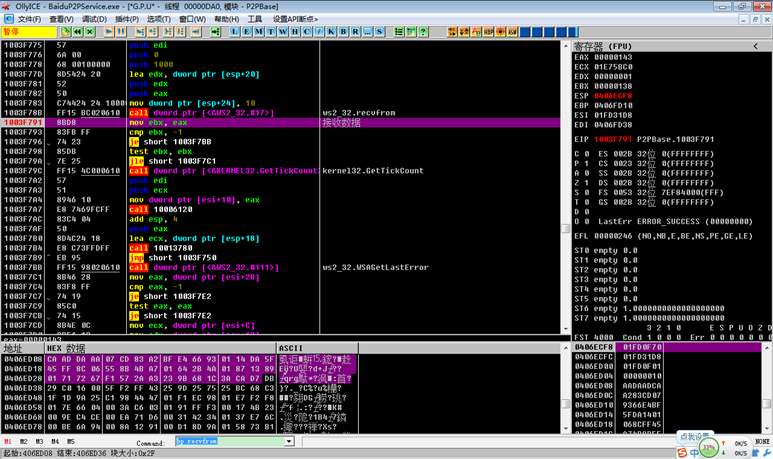

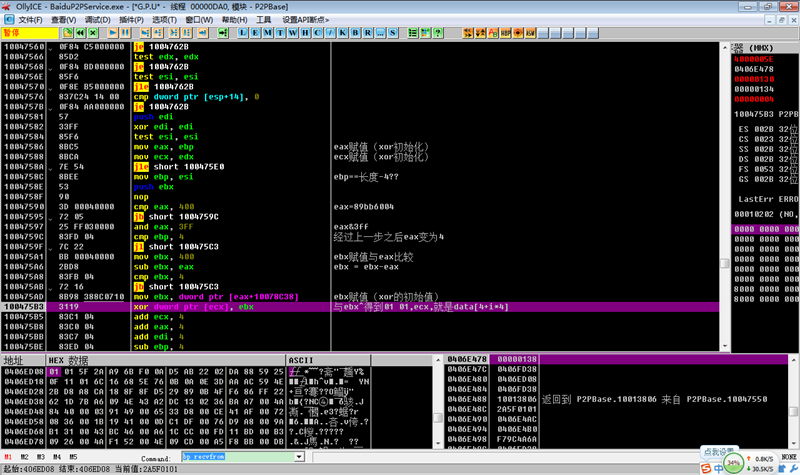

IDA静态分析 提取代码
*********************

利用Ida找到密钥的生成函数并生成伪代码，并结合OllyDbg分析密钥生成函数，下面为Ida伪代码图

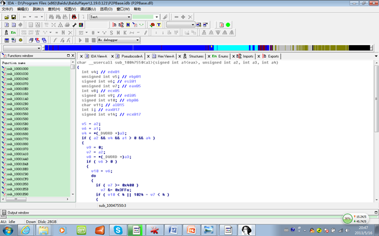

发现使用了byte_10078C38这个变量，必然为全局变量，使用OD查看10078C38内存

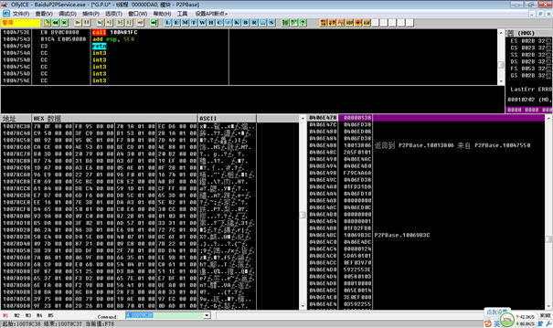

利用Ida找到数据包解密函数00470CE0处生成其伪代码，并结合OllyDbg分析解密函数，下面为Ida伪代码

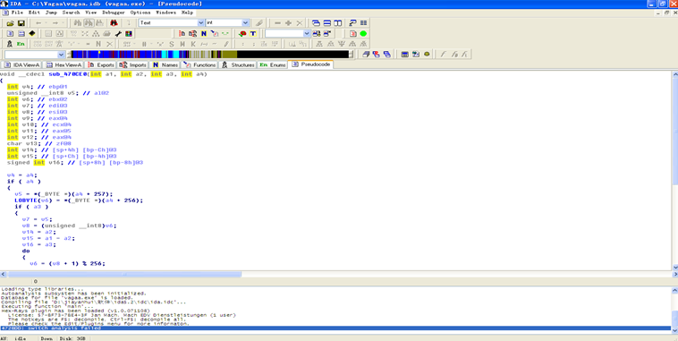

wireshark插件编写(也可以自己写代码)
***************************************

根据解密写wireshark插件,原数据与解密数据对比
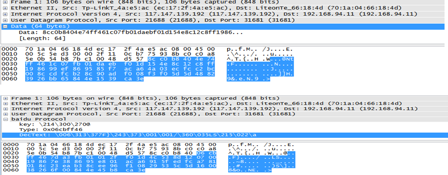

