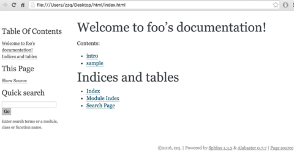
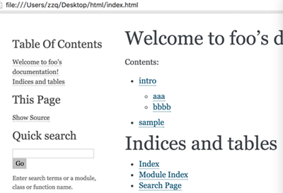
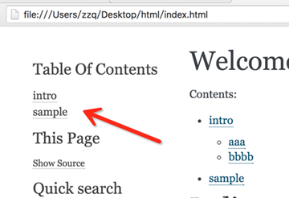
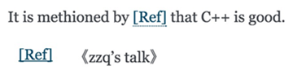
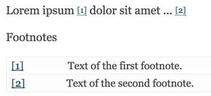

..  Copyright (C), 2014-2016, HAOHAN DATA Technology Co., Ltd.
    All rights reserved.

    @author zhaop
    @date 2016.02.17


如何用sphinx+reST编写文档
=========================


前言
----

写文档是开发人员日常工作中的一项重要内容，除了word之外，我更偏爱\
使用标记语言(Markup Language)。使用标记语言，可以利用简单、免费的\
文本编辑器(记事本，vim, emacs...）编写文档并设置格式，再生成html\
或pdf等格式，或者直接把编辑好的文件传到github或wiki上面 ，通过\
浏览器可以直接查看带有格式的文档。

目前标记语言主要有两种，Markdown和reStructuredText（简称reST)。\
该使用哪一种是一个见仁见智的选择，我在这里就不比较它们（包括其他\
标记语言）的优劣了，感兴趣的可以参考：

* `知乎：Org-mode、reST、 Markdown 各有什么优缺点？\
  <http://www.zhihu.com/question/19851600>`_
* `维基百科（英文）：Lightweight markup language \
  <https://en.wikipedia.org/wiki/Lightweight_markup_language>`_

对我个人来说，一开始尝试了一段时间的Markdown，由于工具不好用以及\
支持的格式不多的原因，转而使用reST，再配合sphinx，感觉好极了。

很多开源项目的文档就是用sphinx+reST做的，比如最近我正关注的\
hyperscan：http://01org.github.io/hyperscan/dev-reference/。\
大家可以点进去看一下生成的效果，它用的样式是Alabaster 0.7.6。

本文以下内容均在Ubuntu 14.04上验证通过。


安装软件包
----------

必须安装的软件包当然是sphinx了::

    sudo apt-get install python-pip
    sudo pip install -U Sphinx

如果要从代码注释生成API文档，需要安装doxygen和breathe插件，后者\
可以让sphinx处理doxygen生成的xml::

    sudo apt-get install doxygen
    sudo pip install breathe 

如果要生成pdf文件，需要安装texlive::

    sudo apt-get install texlive-full

如果条生成中文pdf，则需要确认安装了必要的东亚语言和字体包，比如\
texlive-lang-cjk和texlive-fonts-recommended，可以参考\
http://www.tuicool.com/articles/nAJJVb 。


项目建立
--------

最简单的方法是建立工作目录后（这里是doc），在其中运行sphinx-quickstart。\
运行此命令后sphinx会问你一些问题，根据情况回答即可。在这里我建立\
了一个名为foo的Project，版本是1.0，作者名为zzq，将source与build\
目录放开，其他都选默认::

    zzq@vmware:~/doc$ sphinx-quickstart 
    Welcome to the Sphinx 1.3.3 quickstart utility.

    Please enter values for the following settings (just press Enter to
    accept a default value, if one is given in brackets).

    Enter the root path for documentation.
    > Root path for the documentation [.]: 

    You have two options for placing the build directory for Sphinx output.
    Either, you use a directory "_build" within the root path, or you separate
    "source" and "build" directories within the root path.
    > Separate source and build directories (y/n) [n]: y

    Inside the root directory, two more directories will be created; "_templates"
    for custom HTML templates and "_static" for custom stylesheets and other static
    files. You can enter another prefix (such as ".") to replace the underscore.
    > Name prefix for templates and static dir [_]: 

    The project name will occur in several places in the built documentation.
    > Project name: foo
    > Author name(s): zzq

    Sphinx has the notion of a "version" and a "release" for the
    software. Each version can have multiple releases. For example, for
    Python the version is something like 2.5 or 3.0, while the release is
    something like 2.5.1 or 3.0a1.  If you don't need this dual structure,
    just set both to the same value.
    > Project version: 1.0
    > Project release [1.0]: 

    If the documents are to be written in a language other than English,
    you can select a language here by its language code. Sphinx will then
    translate text that it generates into that language.

    For a list of supported codes, see
    http://sphinx-doc.org/config.html#confval-language.
    > Project language [en]: 

    The file name suffix for source files. Commonly, this is either ".txt"
    or ".rst".  Only files with this suffix are considered documents.
    > Source file suffix [.rst]: 

    One document is special in that it is considered the top node of the
    "contents tree", that is, it is the root of the hierarchical structure
    of the documents. Normally, this is "index", but if your "index"
    document is a custom template, you can also set this to another filename.
    > Name of your master document (without suffix) [index]: 

    Sphinx can also add configuration for epub output:
    > Do you want to use the epub builder (y/n) [n]: 

    Please indicate if you want to use one of the following Sphinx extensions:
    > autodoc: automatically insert docstrings from modules (y/n) [n]: 
    > doctest: automatically test code snippets in doctest blocks (y/n) [n]: 
    > intersphinx: link between Sphinx documentation of different projects (y/n) [n]: 
    > todo: write "todo" entries that can be shown or hidden on build (y/n) [n]: 
    > coverage: checks for documentation coverage (y/n) [n]: 
    > pngmath: include math, rendered as PNG images (y/n) [n]: 
    > mathjax: include math, rendered in the browser by MathJax (y/n) [n]: 
    > ifconfig: conditional inclusion of content based on config values (y/n) [n]: 
    > viewcode: include links to the source code of documented Python objects (y/n) [n]: 

    A Makefile and a Windows command file can be generated for you so that you
    only have to run e.g. `make html' instead of invoking sphinx-build
    directly.
    > Create Makefile? (y/n) [y]: 
    > Create Windows command file? (y/n) [y]: 

    Creating file ./source/conf.py.
    Creating file ./source/index.rst.
    Creating file ./Makefile.
    Creating file ./make.bat.

    Finished: An initial directory structure has been created.

    You should now populate your master file ./source/index.rst and create other documentation
    source files. Use the Makefile to build the docs, like so:
       make builder
    where "builder" is one of the supported builders, e.g. html, latex or linkcheck.

执行完以上命令上doc目录中有以下内容（根据执行sphinx-quickstart\
命令时对各问题的回答不同，下文的文件内容和文件名可能有所不同)::

    build  make.bat  Makefile  source

其中source和build分别是源文件和编译生成文件的存放目录，Makefile和\
make.bat分别是Linux和Windows下的makefile。

source目录下有以下内容::

    conf.py  index.rst  _static  _templates

其中conf.py是配置文件，index.rst是主框架文件，_static是静态文件\
存放目录，比如可以放一些图片什么的，_templates是模板存放目录。

我们先创建2个文件intro.rst和sample.rst，在里面只写标题。这两个\
文件的内容分别是：

intro.rst::

    intro
    =====

sample.rst::

    sammple
    =======

然后编译index.rst，在toctree指导语句（directive）中加入刚才两个\
文件的文件名，后缀省略，路径是相对于源目录source的::

    Welcome to foo's documentation!                                    
    ===============================                                    
                                                                       
    Contents:                                                          
                                                                       
    .. toctree::                                                       
       :maxdepth: 2                                                    
                                                                          
       intro                                                           
       sample     


此时，可以回到source的上一级目录（有Makefile的目录），运行make html，\
即可在build目录中生成HTML文件::

    zzq@vmware:~/doc/source$ cd ..
    zzq@vmware:~/doc$ make html
    sphinx-build -b html -d build/doctrees   source build/html
    Running Sphinx v1.3.3
    loading pickled environment... done
    building [mo]: targets for 0 po files that are out of date
    building [html]: targets for 2 source files that are out of date
    updating environment: 0 added, 2 changed, 0 removed
    reading sources... [100%] sample                                                                                      
    looking for now-outdated files... none found
    pickling environment... done
    checking consistency... done
    preparing documents... done
    writing output... [100%] sample                                                                                       
    generating indices... genindex
    writing additional pages... search
    copying static files... done
    copying extra files... done
    dumping search index in English (code: en) ... done
    dumping object inventory... done
    build succeeded.

    Build finished. The HTML pages are in build/html.

编译成功后使用浏览器打开build/html目录下的index.html，是这样的:




到此，一次典型的环境配置与html生成步骤就完成了。

如果觉得生成的html主题风格自己不喜欢，可以个性source/conf.py，找到::

    # The theme to use for HTML and HTML Help pages.  See the documentation for
    # a list of builtin themes.                                     
    html_theme = 'alabaster'

把alabaster改成其他主题名就好了 。内置的主题有不少，见：\
http://sphinx-doc.org/theming.html#builtin-themes

conf.py配置
-----------

主题样式
........

设置alabaster主题只需在html_theme中设置名字即可::

    html_theme = 'alabaster'

而要设置更美观的sphinx_rtd_theme主题，需要在文件头部加上::

    import sphinx_rtd_theme

再设置html_theme::

    html_theme = 'sphinx_rtd_theme'

LOGO
....

在html_logo中设置图片文件路径::

    html_logo = './logo.png'

不显示源文件链接
................

默认会在生成的html页中显示rst源文件链接，做如下设置后不显示::

    html_show_sourcelink = False 


index页配置
-----------

主要是设置目录树::

    .. toctree::
        :maxdepth: 3
        :numbered:

        foo
        bar

maxdepth把index.html页中目录的标题显示深度限制设为3，numbered为\
编号。之后空一行，在下面列出各子文档，可以不加文件后缀。

.. note:: 在这里同样要注意代码对齐


修改默认样式
------------

有时候我们会对内置样式不满意，这时候就需要修改css之类的东西。下面\
以修改spinx_rtd_theme样式的右侧内容宽度(默认宽度太小，较长的表格\\
经常格式混乱)为例，说明修改默认样式的方法。

Step1
.....

在_static目录添加my_theme.css，内容如下。

.. code-block:: css

    @import url("theme.css");

    .wy-nav-content {
        max-width: 1080px
    }

Step2
.....

修改conf.py，添加以下函数。

.. code-block:: python

    def setup(app):
        app.add_stylesheet("my_theme.css")

Step3
.....

重新编译文档即可。

生成API文档
-----------

可以配合使用sphinx+reST+breathe+doxygen来给代码生成API文档并无缝\
添加到已有的文档结构中。

Step1
.....

运行::

    doxygen -g

生成doxygen配置文件(默认文件名是Doxyfile)，然后修改此文件：

* **项目名称** PROJECT_NAME = "MyProject" 
* **对C项目优化** OPTIMIZE_OUTPUT_FOR_C  = YES
* **源文件路径** INPUT = /home/tom/project/include
* **源文件编码** INPUT_ENCODEING = UTF-8
* **生成XML** GENERATE_XML = YES
  因为要使用breathe扩展，所以必须生成xml
* **XML输出目录** XML_OUTPUT = my_xml
* **不需要生成html** GENERATE_HTML = NO
* **不需要生成latex** GENERATE_LATEX = NO
* **不显示包含文件** SHOW_INCLUDE_FILES = NO

Step2
.....

运行::

    doxygen [Doxyfile]

输出注释，主要是xml。


Step3
.....

配置conf.py，以支持breathe扩展。前提是这一扩展已经安装。

加入扩展::

    extensions = ['breathe']

配置breathe::

    breathe_projects = { "myproject": "./my_xml" }
    breathe_default_project = "myproject"
    breathe_domain_by_extension = {"h" : "c"}

Step4
.....

按breathe扩展语法编写rst文件，比如::

    My API
    ==========

    sp.h
    ----

    .. doxygenfile:: sp.h

上面的语句为项目中的sp.h接口文件生成了html文档。

最后，运行 ``make html`` 生成html即可。

在这些步骤中，需要先调用doxygen生成xml，再调用sphinx-build\
(make html时自动调用)生成最终文档，如果想一步完成，可以在Makefile\
中加入doxygen调用::

    html:                                                           
    ->>>doxygen Doxyfile                                            
    ->>>$(SPHINXBUILD) -b html $(ALLSPHINXOPTS) $(BUILDDIR)/html    
    ->>>@echo                                                       
    ->>>@echo "Build finished. The HTML pages are in $(BUILDDIR)/html."


生成PDF
-------

生成PDF的前提是安装了texlive，如果要生成中文PDF，还需要确认安装了\
东亚语言包和字体包(texlive-lang-cjk, texlive-fonts-recommands之类）。

然后配置conf.py，在latex_elements中加入::

    latex_elements = {
    # The paper size ('letterpaper' or 'a4paper').
    #'papersize': 'letterpaper',

    # The font size ('10pt', '11pt' or '12pt').
    #'pointsize': '10pt',

    # Additional stuff for the LaTeX preamble.
    'preamble': '''                                                 
    \\hypersetup{unicode=true}                                      
    \\usepackage{CJKutf8}                                           
    \\AtBeginDocument{\\begin{CJK}{UTF8}{gbsn}}                     
    \\AtEndDocument{\\end{CJK}}                                     
    ''', 

最后运行 ``make latexpdf`` 即可。


reST语法介绍
------------
reStructuredText标记语言比Markdown强大很多，支持多种排版样式。\
不过这里只介绍开发人员主要会用到的一些样式。reST文档的详细介绍见\
http://docutils.sourceforge.net/rst.html

章节标题
........

在文本下一行（或上一行）添加至少与文本长度同宽的符号，即可以使\
文本成为标题。但并没有规定某一个级别的标题必须用什么字符，可以\
参考python文档的一些约定::

* # with overline, for parts
* * with overline, for chapters
* =, for sections
* -, for subsections
* ^, for subsubsections
* ", for paragraphs

我们把intro.rst改成下面这样::

    intro                                                              
    =====                                                              
                                                                       
    aaa                                                                
    ---                                                                
    aaaaaaaaaaaa                                                       
                                                                       
    bbbb                                                               
    ----                                                               
    bbbbbbbbbbb

其中，intro是一级标题，aaa和bbbb是二级标题。生成的html标签分别是\
<h1>和<h2>。  回到上一级目录重新\
make html，此时首页index.html效果如下：          
                                               


在右边的Contents中，sphinx已经给我们生成了各文件的标题链接，深度为2，\
深度可以在index.rst中的maxdepth中设置。然而index.html左边的导航里\
并没有各文件的链接，像intro.html里那样，这个可以通过修改conf.py实现，\
找到html_sidebars，改为::

    html_sidebars = { '**': ['globaltoc.html', 'sourcelink.html', 'searchbox.html']}

修改后保存，重新make html，index.html左边导航变为如下这样：



.. note:: 有些主题(theme)会自动完成添加左侧导航的功能

段落
....

段落是构成reST文档的基本单位。通过一个或一个以上的空行隔开的文本\
区块就是一个段落。正如在python里一样，reST中的缩进非常重要。同\
一段落的多个文本行必须有一样的缩进。

注意在段落内换行并不会在html中生成换行符，要想保持在文本编辑器中\
的换行符，需要在这些行前面加上|和空格::

    | aaaaaaaa                                                      
    | bbbbbbbbb                                                     
    | cccccccccccc 

.. note:: 如果编写中文reST文档，在编辑器中由于一行文字太长需要强制\
    换行时，记得在行末加\\，否则生成的html会在行末和下一行行首\
    之前插入一个空格

行内标记
........

行内标记常用的有:

* 字体加粗 两个星号
* 字体倾斜 一个星号
* 代码或内容引用 两个反引号（`）

示例::

    aaaa **加粗** aaaaa                                                
    aaaa *倾斜* aaaaa                                                  
    aaaaa ``引用`` aaaaaa  

效果：

aaaa **加粗** aaaaa                                                
aaaa *倾斜* aaaaa                                                  
aaaaa ``引用`` aaaaaa  

注意这些符号在前后不能有非空白字符，否则无法生效。

列表
....

* 符号列表 \*号后空格
* 编号列表 数字加点加空格，或者#号加点加空格
* 定义列表 术语（只能一行）的下一行缩进，下一行为定义内容

示例::

    * item                                                          
    * item                                                          
    * item                                                          
                                                                      
    1. item1                                                        
    2. item2                                                        
    3. item3                                                        

    #. item4                                                        
    #. item5                                                        
    #. item6                                                        
                                                                                                                                                                         
    FOO                                                             
    this is very interesting.                                   
                                                             
    BAR                                                             
    this is interesting, too.  

效果：

* item                                                          
* item                                                          
* item                                                          
                                                                  
1. item1                                                        
2. item2                                                        
3. item3                                                        

#. item4                                                        
#. item5                                                        
#. item6                                                        
                                                                                                                                                                     
FOO                                                             
this is very interesting.                                   
                                                         
BAR                                                             
this is interesting, too.  


代码
....

在文档中列出代码是开发人员经常用到的一个功能。在reST文档中列出代码有三种方式：

* 行内代码 用``code``
* 简单代码块 在代码块的上一个段落后面加2个冒号，空一行后开始代码块，代码块要缩进
* 复杂代码块 使用code-block指导语句，还可以选择列出行号和高亮重点行等

示例::

    source code below ::                                             

    void foo()                                                  
    {
        int i;                                                  

        for(i=0; i<10; i++)                                     
        printf("i: %d\n", a);                               
    }                                                           

    source code again                                               

    .. code-block:: c                                               
        :linenos:                                                   
        :emphasize-lines: 3,6                                       

        void foo()                                                  
        {
            int i;                                                  

            for(i=0; i<10; i++)                                     
            printf("i: %d\n", a);                               
        }

效果：

source code below ::                                             

    void foo()                                                  
    {
        int i;                                                  

        for(i=0; i<10; i++)                                     
        printf("i: %d\n", a);                               
    }                                                           

source code again                                               

.. code-block:: c                                               
    :linenos:                                                   
    :emphasize-lines: 3,6                                       

    void foo()                                                  
    {
        int i;                                                  

        for(i=0; i<10; i++)                                     
        printf("i: %d\n", a);                               
    }


超链接
......

主要有两种方式：

* 行内超链接 语法`链接文字 <URL>`_
* 分开的超链接 用到链接的地方`链接文字`_, 定义链接的地方 .. _链接文字: URL
* 记住链接URL要加http://前缀，不要直接从网址开始写。

示例::

    visit `baidu <http://www.baidu.com>`_                           

    visit `baidu URL`_                                              
                                                                
    .. _baidu URL: http://www.baidu.com   

效果：

visit `baidu <http://www.baidu.com>`_                           

visit `baidu URL`_                                              
                                                            
.. _baidu URL: http://www.baidu.com   


图片
....

使用image指导语句。

示例::

    baidu logo:                                                     
                                                                    
    .. image:: img/bdlogo.png                                   
        :width: 200px 

效果：

baidu logo:                                                     
                                                                
.. image:: img/bdlogo.png                                   
    :width: 200px 

也可以使用figure指导语句，figure可以空一行，接着写图片标题。

示例::

    .. figure:: img/bdlogo.png
        :width: 200px

        Baidu LOGO

效果：

.. figure:: img/bdlogo.png
    :width: 200px

    Baidu LOGO


表格
....

使用文本字符绘制的表格。简单表格用的字符较少，但功能有限，如不能\
表格行不能换行；复杂不及格使用的字符较多。

示例::

    simple table:                                                   
                                                                
    =====  =====  ======                                            
    Inputs        Output                                            
    ------------  ------                                            
    A      B      A or B                                            
    =====  =====  ======                                            
    False  False  False                                             
    True   False  True
    False  True   True                                              
    True   True   True                                              
    =====  =====  ======                                            
                                                                   
    grid table: 
                                                                  
    +------------------------+------------+----------+----------+   
    | Header row, column 1   | Header 2   | Header 3 | Header 4 |   
    | (header rows optional) |            |          |          |   
    +========================+============+==========+==========+   
    | body row 1, column 1   | column 2   | column 3 | column 4 |   
    +------------------------+------------+----------+----------+   
    | body row 2             | Cells may span columns.          |   
    +------------------------+------------+---------------------+   
    | body row 3             | Cells may  | Table cells         |   
    +------------------------+ span rows. | contain             |   
    | body row 4             |            | body elements.      |   
    +------------------------+------------+---------------------+

效果:

simple table:                                                   
                                                            
=====  =====  ======                                            
Inputs        Output                                            
------------  ------                                            
A      B      A or B                                            
=====  =====  ======                                            
False  False  False                                             
True   False  True
False  True   True                                              
True   True   True                                              
=====  =====  ======                                            
                                                               
grid table: 
                                                              
+------------------------+------------+----------+----------+   
| Header row, column 1   | Header 2   | Header 3 | Header 4 |   
| (header rows optional) |            |          |          |   
+========================+============+==========+==========+   
| body row 1, column 1   | column 2   | column 3 | column 4 |   
+------------------------+------------+----------+----------+   
| body row 2             | Cells may span columns.          |   
+------------------------+------------+---------------------+   
| body row 3             | Cells may  | Table cells         |   
+------------------------+ span rows. | contain             |   
| body row 4             |            | body elements.      |   
+------------------------+------------+---------------------+

引用
....

一种是传统的参考文献引用格式。

示例::

    It is methioned by [Ref]_ that C++ is good.                     
                                                                    
    .. [Ref] 《zzq's talk》

效果：



类似于书签的引用，被引用的内容可以在另一个reST文档中。在引用的地方, \
使用 ``:ref:`bookmark``` 这种语法，在被引用内容的上方, 使用
``_bookmark:`` 的语法。下方的标题将变成书签链接的文本。

示例::

    附录 :ref:`ewma_algo` 中也有介绍。
    
    .. _ewma_algo:  

    EWMA Algo
    ---------
    (被引用的内容） 

文档间引用，引用另一文档，格式是 ``:doc:`file_name``` 。

示例::

    sniper知识库格式发生了一些变化，见 :doc:`rule_format` 。

脚注
....

与引用语法类似，只是它在正文中显示的不是文本，而是编号。

示例::

    orem ipsum [#f1]_ dolor sit amet ... [#f2]_                    
                                                                    
    Footnotes                                                       
                                                                    
    .. [#f1] Text of the first footnote.                            
    .. [#f2] Text of the second footnote.   

效果：



提醒
....

可以使用提醒指导语句来添加需要提醒读者注意的说明文字。

示例::

    .. note:: this is a note.

    .. warning:: this is a warning.

    .. error:: this is an error.


效果:

.. note:: this is a note.

.. warning:: this is a warning.

.. error:: this is an error.

已实现的提醒指导语句有：

* attention
* caution
* danger
* error
* hint
* important
* note
* tip
* warning

替换
....

替换类似脚注，在正文中使用|text|这样标签，然后可以设定使用其他\
文本或者图片来代替text这个占位符。

示例::

    I like eat |apple| very much.                                   
                                                                    
    .. |apple| replace:: 苹果  

效果::

    I like eat 苹果 very much.


参考
----

.. [sphinx_site] `sphinx-doc官网 <http://sphinx-doc.org/index.html>`_
.. [reST] `reStructuredText标记语言规范 <http://docutils.sourceforge.net/docs/ref/rst/restructuredtext.html>`_
.. [gen_chn_pdf] `使用sphinx制作中文PDF <http://www.tuicool.com/articles/nAJJVb>`_


