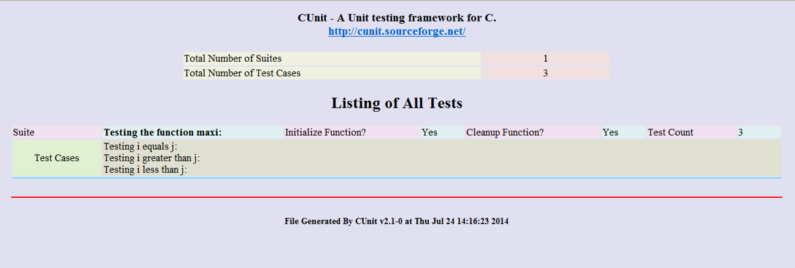

..  Copyright (C), 2014-2016, HAOHAN DATA Technology Co., Ltd.
    All rights reserved.

    @author zhaop
    @date 2016.02.24

CUnit测试工具
=============

简介
----

CUnit是一个c语言的单元测试框架，它是以静态链接库的形式，连接到\
用户代码中的，主要的功能就是提供了语义丰富的断言和多种测试结果\
输出接口，可以方便地生成测试报告。

数据类型和函数在如下文件用为标准用户定义：

* #include <CUnit/CUnit.h> 在用户的测试中使用的断言宏和包含其他的框架头文件。
* #include <CUnit/CUError.h> 错误处理函数和数据类型，CUnit.h会自动包含此文件。
* #include <CUnit/TestDB.h> 测试注册簿，测试包和测试的数据类型和函数的定义。CUnit.h会自动包含此文件 
* #include <CUnit/TestRun.h> 运行的是和处理结果的数据类型和函数的定义。CUnit.h会自动包含此文件    
* #include <CUnit/Automated.h>  自动生成XML文件模式接口定义.
* #include <CUnit/Basic.h> 　无交互的输出到stdout的基本测试模式接口定义。
* #include <CUnit/Console.h> 与控制台交互模式接口定义.
* #include <CUnit/CUCurses.h>　Curses 图形用户界面交互接口定义.
* #include <CUnit/Win.h>　Windows 接口定义(尚未实现).

CUnit框架的一个典型的使用顺序为（实例详见服务器中例程）：

1. 为测试编写函数(如果需要的话编写测试包的 init/cleanup 函数)
2. 初始化测试注册簿 - CU_initialize_registry()
3. 添加测试包到测试注册簿 - CU_add_suite()
4. 添加测试用例到的是测试包 - CU_add_test()
5. 用适当的接口函数运行测试, 例如 CU_console_run_tests
6. 清理测试注册簿 - CU_cleanup_registry

安装配置
--------

Ubuntu
......

软件源中与cunit相关的包有::

    libcunit1 libcunit1-dev libcunit1-doc libcunit1-ncurses libcunit1-ncurses-dev

使用apt-get install安装即可。

从源码编译
..........

下载地址： https://sourceforge.net/projects/cunit/files/latest/download

步骤:

#. 下载CUnit源码包(假设是2.1.0版本)
#. CUnit源码包的解压
    #tar xzvf CUnit-2.1-0-src.tar.gz

   执行结束后，将会在当前目录下生成一个解压后的文件夹（CUnit-2.1-0）。
#. 解压结束后，开始进行编译和安装.

    #. tar xf CUnit-2.1-3.tar.bz2
    #. cd CUnit-2.1-3
    #. libtoolize -f -c -i
    #. aclocal
    #. autoconf
    #. autoheader
    #. automake
    #. chmod u+x configure
    #. ./configure --prefix=/usr/local 
    #. make                                                        
    #. make install 

也可以使用jam编译::

    1. Set the working directory to the top of the source tree  
    2. Generate Jamrules                                        
           a. On Linux, run autoconf & configure                    
           b. On Windows, copy Jamrules.in to Jamrules              
    3. Edit the top section of Jamrules to match your preferences
    4. jam -f Jambase install 

输出方式
--------

CUnit 提供测试包和测试用例运行控制的原始函数，但是大部分用户想\
使用简化的接口。这些接口处理用户与框架交互的细节，并且提供像测试输出和结果给客户。

在CUnit 库中有如下接口:

========== =========== ===================================
接口       平台        描述
========== =========== ===================================
Automated  All         非交互式输出XML文件
Basic      All         非交互式可选输出到stdout
Console    All         控制台交互方式，在用户的控制下运行
Curses     Linux/Unix  Curses交互在用户控制下运行
========== =========== ===================================

如果这些接口不足以满足用户的需求，用户也可以使用在<CUnit/TestRun.h>\
中定义的原始框架API。可以从原代码中看到各种各样的接口函数。在此简单介绍自动模式：

自动模式接口是非交互式的接口，客户端启动一次测试，测试结果将会\
输出的到一个XML文件当中。对于一组已注册的测试包和测试用例也可以将报告输出到一个XML文件当中。

自动模式接口 API有下面几个函数构成：

void CU_automated_run_tests(void)
.................................

运行所有注册测试包的所有测试用例。测试结果将输出到一个名为\
TestMax-Results.xml的文件。文件名中的ROOT可以通过CU_set_output_filename()\
函数设置，默认的名字为CUnitAutomated-Results.xml。如果每次测试\
没有设置ROOT文件名，新的测试结果将会覆盖上一次测试结果。

测试结果文件也可以是dtd文件（CUnit-Run.dtd）和XSL文件\
（CUnit-Run.xsl）。在代码的子目录和安装树中可以找到。

CU_ErrorCode CU_list_tests_to_file(void)
........................................

把注册的测试包和测试用例列表输出到文件。输出文件的名字为\
TestMax-Listing.xml。文件名中的ROOT可以通过CU_set_output_filename()\
函数设置否则为CUnitAutomated。如果每次测试没有设置ROOT文件名，\
新的列表将会覆盖上一次的列表。

测试结果文件也可以是dtd文件（CUnit-Run.dtd）和XSL文件（CUnit-Run.xsl）。\
在代码的子目录和安装树中可以找到。

列表文件不会再调用CU_automated_run_tests()后自动生成，客户端代码\
必须在需要时显式的申请。

void CU_set_output_filename(const char* szFilenameRoot)
.......................................................

设置测试结果和文件列表输出文件的名字。szFilenameRoot 再加上-Results.xml\
或-Listing.xml,构成输出文件的名字。这两个文件是不能直接观看的，\
要查看这两个文件，需要使用如下xsl和dtd文件：CUnit-List.dtd和\
CUnit-List.xsl用于解析列表文件，CUnit-Run.dtd和CUnit-Run.xsl用于\
解析结果文件。这四个文件在CUnit包里面有提供，安装之后在\
$(PREFIX)/share/CUnit目录下，默认安装的话在/home/安装目录/share/CUnit\
目录下。在查看结果之前，需要把这六 个文件：TestMax-Listing.xml, \
TestMax-Results.xml, CUnit-List.dtd, CUnit-List.xsl, CUnit-Run.dtd, \
CUnit-Run.xsl拷贝到一个目录下，然后用浏览器打开两个结果的xml文件就可以了。

如下图所示：

.. image:: img/cunit_ui2.png

断言
----

CUnit提供一组断言来测试逻辑条件.断言的成功与失败会被框架跟踪并且\
在测试运行完成后可以在报告中查看结果。

CUnit的断言定义如下：

#include <CUnit/CUnit.h>

+-------------------------------------------------------------------+--------------------------------------------------+
| 断言                                                              | 说明                                             |
+===================================================================+==================================================+
| | CU_ASSERT(int expression)                                       | 断言 expression 为 TRUE (非零)                   |
| | CU_ASSERT_FATAL(int expression)                                 |                                                  |
| | CU_TEST(int expression)                                         |                                                  |
| | CU_TEST_FATAL(int expression)                                   |                                                  | 
+-------------------------------------------------------------------+--------------------------------------------------+
| | CU_ASSERT_TRUE(value)                                           | 断言 value 为 TRUE (非零)                        | 
| | CU_ASSERT_TRUE_FATAL(value)                                     |                                                  |
+-------------------------------------------------------------------+--------------------------------------------------+
| | CU_ASSERT_FALSE(value)                                          | 断言 value 为 FALSE (零)                         |
| | CU_ASSERT_FALSE_FATAL(value)                                    |                                                  |
+-------------------------------------------------------------------+--------------------------------------------------+
| | CU_ASSERT_EQUAL(actual, expected)                               | 断言actual = = expected                          |
| | CU_ASSERT_EQUAL_FATAL(actual, expected)                         |                                                  |
+-------------------------------------------------------------------+--------------------------------------------------+
| | CU_ASSERT_NOT_EQUAL(actual, expected))                          | 断言actual != expected                           |
| | CU_ASSERT_NOT_EQUAL_FATAL(actual, expected)                     |                                                  | 
+-------------------------------------------------------------------+--------------------------------------------------+
| | CU_ASSERT_PTR_EQUAL(actual, expected)                           | 断言pointers actual = = expected                 |
| | CU_ASSERT_PTR_EQUAL_FATAL(actual, expected)                     |                                                  |
+-------------------------------------------------------------------+--------------------------------------------------+
| | CU_ASSERT_PTR_NOT_EQUAL(actual, expected)                       | 断言pointers actual != expected                  |
| | CU_ASSERT_PTR_NOT_EQUAL_FATAL(actual, expected)                 |                                                  |
+-------------------------------------------------------------------+--------------------------------------------------+
| | CU_ASSERT_PTR_NULL(value)                                       | 断言pointer value == NULL                        |
| | CU_ASSERT_PTR_NULL_FATAL(value)                                 |                                                  |
+-------------------------------------------------------------------+--------------------------------------------------+
| | CU_ASSERT_PTR_NOT_NULL(value)                                   | 断言pointer value != NULL                        |
| | CU_ASSERT_PTR_NOT_NULL_FATAL(value)                             |                                                  |
+-------------------------------------------------------------------+--------------------------------------------------+
| | CU_ASSERT_STRING_EQUAL(actual, expected)                        | 断言strings actual and expectedare equivalent    |
| | CU_ASSERT_STRING_EQUAL_FATAL(actual, expected)                  |                                                  |
+-------------------------------------------------------------------+--------------------------------------------------+
| | CU_ASSERT_STRING_NOT_EQUAL(actual, expected)                    | 断言strings actual and expected differ           |
| | CU_ASSERT_STRING_NOT_EQUAL_FATAL(actual, expected)              |                                                  |
+-------------------------------------------------------------------+--------------------------------------------------+
| | CU_ASSERT_NSTRING_EQUAL(actual, expected, count)                | 断言actual 的前面count个字符 与expected相同      |
| | CU_ASSERT_NSTRING_EQUAL_FATAL(actual, expected, count)          |                                                  |
+-------------------------------------------------------------------+--------------------------------------------------+
| | CU_ASSERT_NSTRING_NOT_EQUAL(actual, expected, count)            | 断言actual 的前面count个字符与expected 不同      |
| | CU_ASSERT_NSTRING_NOT_EQUAL_FATAL(actual, expected, count)      |                                                  |
+-------------------------------------------------------------------+--------------------------------------------------+
| | CU_ASSERT_DOUBLE_EQUAL(actual, expected, granularity)           | 断言 \|actual - expected| <= \|granularity|      |
| | CU_ASSERT_DOUBLE_EQUAL_FATAL(actual, expected, granularity)     | 数学库必须连接到程序当中                         |
+-------------------------------------------------------------------+--------------------------------------------------+
| | CU_ASSERT_DOUBLE_NOT_EQUAL(actual, expected, granularity)       | 断言 \|actual - expected| > \|granularity|       |
| | CU_ASSERT_DOUBLE_NOT_EQUAL_FATAL(actual, expected, granularity) | 数学库必须连接到程序当中                         |
+-------------------------------------------------------------------+--------------------------------------------------+
| | CU_PASS(message)                                                | 注册一个带有消息的通过断言,在没有逻辑测试运行时  |
+-------------------------------------------------------------------+--------------------------------------------------+
| | CU_FAIL(message)                                                | 注册一个带有消息的失败断言,在没有逻辑测试运行时  |
| | CU_FAIL_FATAL(message)                                          |                                                  |
+-------------------------------------------------------------------+--------------------------------------------------+

错误处理
--------

大多数CUnit函数设置一个错误代码用来指示框架的错误状态。有些函数\
返回错误代码，其他的则设置错误代码返回其他值。框架提供两个函数用\
来检查框架的错误状态::

    CU_ErrorCode CU_get_error(void)
    const char* CU_get_error_msg(void)

第一个函数返回错误代码本身，第二个函数返回一个描述错误状态的消息。\
错误代码是一个在<CUnit/CUError.h>中定义的枚举类型CU_ErrorCode。\
下面是错误代码值的定义：

====================== ========================================
错误代码的值           描述
====================== ========================================
CUE_SUCCESS            没有错误.
CUE_NOMEMORY           内存分配失败
CUE_NOREGISTRY         测试注册簿未初始化
CUE_REGISTRY_EXISTS    在没有调用CU_cleanup_registry()函数的情况下试图调用CU_set_registry()函数
CUE_NOSUITE CU_pSuite  指针是NULL.
CUE_NO_SUITENAME       CU_Suite名字未指定
CUE_SINIT_FAILED       测试包初始化失败
CUE_SCLEAN_FAILED      测试包清理错误
CUE_DUP_SUITE          测试包重名
CUE_NOTEST             CU_pTest 指针是NULL.
CUE_NO_TESTNAME        CU_Test 名字未指定
CUE_DUP_TEST           测试用例重名
CUE_TEST_NOT_IN_SUITE  测试用例没有注册到指定的测试包中
CUE_FOPEN_FAILED       文件打开失败
CUE_FCLOSE_FAILED      文件关闭失败
CUE_BAD_FILENAME       错误的文件名 (NULL,空,不存在, 等等.).
CUE_WRITE_ERROR        写文件错误
====================== ========================================

参考
----

.. [cunit] `cunit官网 <http://cunit.sourceforge.net/>`_

