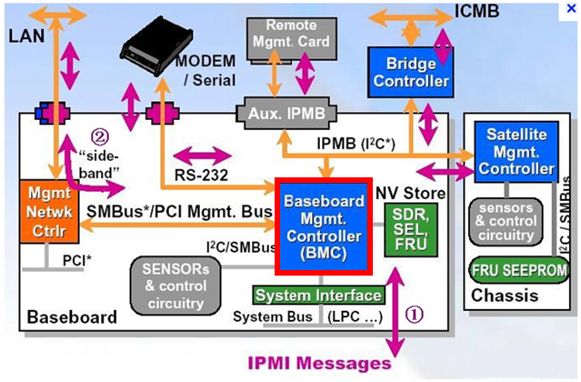

IPMI概述
========

1 简介
------

IPMI是智能型平台管理接口（Intelligent Platform Management Interface）的缩写。用户可以利用IPMI监视服务器的物理特征，如温度、电压、电扇工作状态、电源供应以及机箱入侵等。IPMI最大的优势在于它是独立于CPU，BIOS和OS的，所以用户无论在开机还是关机的状态下，只要接通电源就可以实现对服务器的监控。IPMI是一种规范的标准，由美国英特尔、惠普（Hewlett-Packard）、NEC、美国戴尔电脑和SuperMicro等公司制定。最新的版本是IPMI2.0。

2 名词解释
----------

IPMI：智能平台管理界面(Intelligent Platform Management Interface)的缩写，它是管理基于Intel结构的企业系统中所使用外围设备采用的一种工业标准。

BMC：底板管理控制器(Baseboard Management Controller)的缩写，这是一个在IPMI结构下提供智能管理的控制器。

3 主要功能
----------

1. 可以在服务器通电（没有启动操作系统）情况下，对它进行远程管理：开机、关机、重启。当机房出现断电情况后或者远程服务器出现宕机或者串口卡死等问题，无法对服务器进行控制时，我们可以通过IPMI协议远程开启或者重启服务器。

2. 基于文本的控制台重定向，可以远程查看和修改bios设置，系统启动过程，登入系统等。

3. 可以远程通过sol连接服务器，解决ssh服务无法访问，远程安装系统，查看系统启动故障等问题。

4 IPMI管理工具
--------------

常用的管理工具是ipmitool，Linux下需要先安装OpenIPMI驱动并启动。它支持 ipmi 1.5 规范（最新的规范为 ipmi 2.0），通过它可以实现获取传感器的信息、显示系统日志内容、网络远程开关机等功能。

4.1 安装管理工具
^^^^^^^^^^^^^^^^

#rpm -ivh gdbm-1.10-8.el7.x86_64.rpm

#rpm -ivh gdbm-devel-1.10-8.el7.x86_64.rpm

#rpm -ivh OpenIPMI-modalias-2.0.19-15.el7.x86_64.rpm

#rpm -ivh OpenIPMI-libs-2.0.19-15.el7.x86_64.rpm

#rpm -ivh OpenIPMI-libs-2.0.19-15.el7.x86_64.rpm

4.2 加载IPMI内核
^^^^^^^^^^^^^^^^

#modprobe ipmi_msghandler

#modprobe ipmi_devintf

#modprobe ipmi_si

5 IPMI命令
----------

5.1 ipmitool命令
^^^^^^^^^^^^^^^^

ipmitool本地监控使用命令: ipmitool –I open command，其中-I open表示使用OpenIPMI接口，常用command有以下项：

1) raw：发送一个原始的IPMI请求，并且打印回复信息。

2) Lan：配置网络（lan）信道(channel)。

3) chassis ：查看底盘的状态和设置电源。

4) event：向BMC发送一个已经定义的事件（event），可用于测试配置的SNMP是否成功。

5) mc：查看MC（Management Contollor）状态和各种允许的项。

6) sdr：打印传感器仓库中的所有监控项和从传感器读取到的值。

7) Sensor：打印详细的传感器信息。

8) Fru：打印内建的Field Replaceable Unit (FRU)信息。

9) Sel：打印 System Event Log (SEL)。

10) Pef：设置 Platform Event Filtering (PEF)，事件过滤平台用于在监控系统发现有event时候，用PEF中的策略进行事件过滤，然后看是否需要报警。

11) Sol/isol：用于配置通过串口的Lan进行监控。

.. note:: ipmitool 工具详细命令参数很多，此处不一一列举，详细请看ipmitool命令帮助文档。

5.2 常用命令模板
^^^^^^^^^^^^^^^^

1) 使用静态地址：ipmitool lan set <channel_no> ipsrc static

2) 使用动态地址：ipmitool lan set <channel_no> ipsrc dhcp

3) 设置IP：ipmitool lan set <channel_no> ipaddr <x.x.x.x>

4) 设置掩码：ipmitool lan set <channel_no> netmask <x.x.x.x>

5) 设置网关：ipmitool lan set <channel_no> defgw ipaddr <x.x.x.x>

6) 本地操作 -I open 表示接口本地：ipmitool -I open lan print 1

7) 操作远程机器 -I lan 表示接口远程：ipmitool -I lan -H 10.1.199.12 -U ADMIN -P ADMIN lan print 1

.. note:: DELL的<channel_no>是1，HP的是2 ，超微的是1，我司的<channel_no>是1。

6、远程管理
-----------

6.1 设置BMC信息
^^^^^^^^^^^^^^^

开启IPMI远程管理
#ipmitool -I open lan set 1 access on

配置BMC的IP
#ipmitool -I open lan set 1 ipaddr 10.10.22.151

配置BMC的掩码
#ipmitool -I open lan set 1 netmask 255.255.255.0

配置BMC的网关
#ipmitool -I open lan set 1 defgw ipaddr 10.10.22.1

6.2 配置用户
^^^^^^^^^^^^

查看BMC用户信息
#ipmitool user list 1

添加用户名
#ipmitool user set name 3 aaa

配置用户密码
#ipmitool user set password 3 aaa

配置root密码
#ipmitool user set password 2 123456

6.3 查看bmc信息
^^^^^^^^^^^^^^^

查看BMC配置信息
#ipmitool lan print 1

查看系统事件日志sel（system event log）
#ipmitool -I lan -H 10.10.22.151 -U root -P tma1100 sel list

6.4 远程操作
^^^^^^^^^^^^

查看电源状态
#ipmitool -I lan -H 10.10.22.151 -U root -P tma1100 power status

远程重启
#ipmitool -I lan -H 10.10.22.150 -U root -P tma1100 power reset

远程开机
#ipmitool -I lan -H 10.10.22.150 -U root -P tma1100 power on

远程关机
#ipmitool -I lan -H 10.10.22.150 -U root -P tma1100 power down

