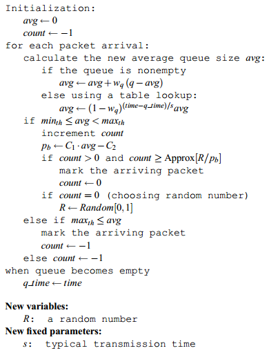
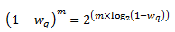

14 Scheduling Packets
=====================

14.1 概述
---------

最简单的情况下，网络设备对流量采取的是“尽力而为”的策略。可以想象\
在Tx处有一个FIFO发送队列，当设备处理不过来时，队列满，后到的报文\
无法入队，将被丢弃。这种机制可以称为FIFO with tail-drop。

对于一个现代的网络设备来说，仅仅使用上述简单机制是不行的，而是\
满足以下几个需求：

* 拥塞控制

  链路的拥塞几乎是不可避免的。TCP协议虽然有拥塞避免机制，但仍需要在\
  设备上实现某种拥塞控制机制，协助TCP的拥塞避免机制更好地工作，\
  充分利用链路带宽。

* 链路资源均享

  传统的FIFO和tail-drop机制，会使流量较大的业务流量“淹没”流量小\
  但却可能比较重要的业务流量，达不到带宽均享的效果。比如大量的文件\
  下载流量可能会占用同一链路上的所有buffer，导致telnet等报文无法\
  正常传输，telnet客户会发现连接无响应。

* QoS保证 

  链路资源均享的更精确形式是提供带宽保证，例如某ISP可能需要为某\
  客户预留10M带宽。更困难的是提供时延保证，例如保证直播视频流\
  有较小的时延。

报文调度就是为了解决以上问题。针对不同的需求，有不同的调度算法或\
机制。本章对主要的报文调度机制进行了叙述，这些内容有：

* 拥塞控制
* 带宽与突发限制
* 多队列与优先级机制
* 资源预留协议
* 带宽保证 
* 时延保证
* Scalable Fair Queuing 
* dpdk分层调度
* DiffServ架构介绍
* dpdk QoS框架

14.2 拥塞控制
-------------

RED(Random Early Detection, 参考 [red]_ )是一种用于拥塞控制的\
调度机制，它已经成为一个事实上的标准，被广泛应用。

RED通过监视报文队列，动态计算其拥塞程度，并据此以某种规则丢弃\
队列中的报文(即使此时队列仍有空间)，实现拥塞控制。

相比于简单的Tail Drop，RED可以避免TCP的全局同步(\
即TCP发现丢了多个包，从而急剧减小window<慢开始>，拥塞解除；
但后来不再拥塞时又开始加快发送速度，又一次造成拥塞...这样的现象\
周而复始，使得一段时间内设备带宽利用率很低的现象)。

RED只在设备上实现，不需要依赖连接双方。

14.2.1 设计目标
...............

14.2.2 算法
...........

RED使用低通滤波器来计算平均队列长度(avg)。avg与两个门限值比较, 
最小门限min\ :sub:`th`\ ，最大门限max\ :sub:`th`\ 。RED的基本算法\
是：

* 当avg小于最小门限时，不mark任何报文
* 当avg大于最大门限时，mark所有报文
* 当avg介于最小和最大门限之间时，以概率P\ :sub:`a`\  mark报文，
  此概述是avg的函数。Each time that a packet is marked, the
  probability that a packet is marked from a particular connection 
  is roughly proportional to that connection’s share of the 
  bandwidth at the gateway

以概率随机丢弃报文，使得拥塞控制只在个别连接进行，从而避免全局性\
的拥塞控制。

.. image:: _static/red_algo_general.png

所以RED算法分为两部分：

#. **计算平均队列长度**  它决定了队列中所允许的突发度
#. **计算报文mark概率**  它决定了在当前拥塞程度下mark报文的频率，
   目标是以合适的间隔mark报文，以避免偏见和全局同步，并以足够合适\
   的频率mark报文以控制平均队列长度。

RED把设备的报文队列分为3个部分:

.. image:: _static/red_queue.png

mark概率与两个门限值的关系：

.. image:: _static/red_param_relation.png

瞬时队列长度与平均队列长度的区别：

RED详细算法:

平均队列长度的计算
******************

RED使用低通滤波器计算平均队列长度。这样做的好处是，突发或拥塞\
造成的队列长度的短时间增加不会导致平均队列长度有太大的增加。

此低通滤波器是一个”指数加权移动平均“(EWMA)：

    avg = (1 - w\ :sub:`q` ) * avg + w\ :sub:`q` * q

权重参数w\ :sub:`q`\ 确定了低通滤波器的时间常数。w\ :sub:`q`\ 设置过大时，
会导致瞬时拥塞无法通过滤波器；w\ :sub:`q`\ 设置过小时，会使avg对实际队列长度\
的变化响应过慢，从而无法探测到拥塞的初始阶段。

两个门限的设置取决于想要的平均队列长度。min\ :sub:`th`\ 与典型\
流量的突发性有关；max\ :sub:`th`\ 与时延有关。当(max\ :sub:`th` -
min\ :sub:`th`\ )大于一次RTT内avg的增加值时RED算法最为有效。一个\
经验法则是把max\ :sub:`th`\ 至少设为min\ :sub:`th`\ 的两倍。

EWMA见 [ewma]_ , 附录 :ref:`ewma_algo` 中也有介绍。

参数选取原则
************

* w\ :sub:`q` >= 0.001
* min\ :sub:`th`\ 足够大以充分利用带宽
* (max\ :sub:`th` - min\ :sub:`th`\ )足够大以避免全局同步

优化的RED算法
*************

14.2.3 WRED
...........

// TODO

14.2.4 dpdk red的相关实现
.........................

RED在dpdk中的实现代码在

* lib/librte_sched/rte_red.h
* lib/librte_sched/rte_red.c

RED/WRED是dpdk Dropper的一部分，它与Scheduler的集成关系如下图所示：

dpdk Dropper支持3种算法：RED、WRED和Tail Drop。在运行时先使用RED/WRED检测，
再使用Tail Drop检测。

dpdk Dropper的用法如下：

#. 初始化配置数据
#. 初始化运行时数据
#. 入队(Enqueue)，决定将报文入队还是丢弃
#. mark空队(Mark Empty)，当报文队列为空时记下时间

14.2.4.1 配置
*************

dpdk RED共有4个配置参数：最小门限、最大门限、mark概率倒数，以及EWMA权重。

+-----------------------------+-----+------+--------------+
| 参数                        | Min | Max  | 典型值       |
+=============================+=====+======+==============+
| 最小门限 Min\ :sub:`th`     | 0   | 1022 | 1/4 队列长度 |
+-----------------------------+-----+------+--------------+
| 最大门限 Max\ :sub:`th`     | 1   | 1023 | 1/2 队列长度 |
+-----------------------------+-----+------+--------------+
| mark概率倒数 1/max\ :sub:`p`| 1   | 255  | 10           |
+-----------------------------+-----+------+--------------+
| EWMA权重 w\ :sub:`q`        | 1   | 12   | 9            |
+-----------------------------+-----+------+--------------+

这里，mark概率是以倒数形式给出的，比如概率是1%=1/100，则这个配置\
值就是100。EWMA权重是实际权重的倒数的2的对数，比如实际权重是1/2^9，
那么它的倒数是2^9，再取2的对数，即9做为这里的配置值。

14.2.4.2 Enqueue
****************

dpdk Dropper的数据流如下图所示：

.. image:: _static/red_dpdk_dataflow.png

其中，q是实际队列长度，avg是计算得到的平均队列长度，count是上次\
丢弃到现在的报文数，decision是判断结果。其作参数都是配置值。

**EWMA模块**

这里使用了 [red]_ 提到的优化算法。wq = 1/2^n，n就是上面配置参数\
中的EWMA权重。

队列为空时，avg不能突然变为0或者继续保持旧值，而是应逐渐衰减为0。
此时需要求m值，m = (time-qtime)/s。上面的算法已经提到过，s是\
连续两次入队操作之间的典型时间间隔。

时间基准是以字节为单位的，1个字节单位表示网卡发送1个字节所需的\
时间长度。dpdk Dropper中参数s被定义为一个常数2^22，表示64K个叶子\
节点(每个节点都是一个报文队列)中的每个节点发送一个64字节报文\
所需的时间，它表示了最坏的场景。2^22 = 64*1024*64。这个值在\
rte_red.h中定义为RTE_RED_S宏。

对(1-wq)^m的计算采取了优化算法。已知

经过变换之后，log2(1-wq)通过查表求得，那么再乘以m，并进行移位操作，
即可求得(1-wq)^m。为了避免算法计算溢出，m和查表值限制为16 bit。

**Drop模块**

Drop模块的功能是：

* 将平均队列长度与最小、最大门限进行比较
* 计算报文丢弃概率
* 随机选择入队或丢弃报文

丢弃概率的计算分2个阶段：

#. Pb 初始丢弃概率
#. Pa 实际丢弃概率

Pa的计算将count参数考虑在内，使得其值随着上次丢弃后到达报文的增加\
而增加。

    Pa = Pb/(2 - count * Pb)

注意这里分母中的常数为2，而 [red]_ 中的常数为1。当此常数为1时将\
导致更高的丢弃概率，比较见下图：

14.2.4.3 Mark Empty
*******************

必须记录队列为空的时刻，API调用方负责通知Dropper队列为空的事件。

.. _dpdk_time:

14.2.4.4 时间值的使用
*********************

在Dropper中需要用到时间值，这里的时间值是以字节为单位表示的，即\
1字节单位表示网卡发送一个字节所需的时间长度。由于Scheduler每次\
将报文转给NIC Tx的时候都递增其内部时间戳，所以用字节单位来表示\
是方便的。这样，当1个报文被调度到Tx时，time += (n+h)，n是报文长度，
h是每个报文所需的分帧开销(framing overhead)。

Scheduler的内部时间戳需要与NIC Tx的速率保持一致，以免报文发送速度\
过快超过线速导致丢包。在每次出队时，Scheduler读取当前时间。CPU\
时间戳可以通过TSC寄存器或者HPET寄存器取得，然后通过以下公式从\
CPU时钟数转换为字节数：

    time_bytes = time_cycles / cycles_per_byte

这里cycles_per_byte就是传输1个字节所需的cpu cycles。比如，对于频率\
为2GHz的CPU和10GbE网口：

    cycles_per_byte = 2000000000 / 10000000000 * 8 = 1.6

Scheduler维护一个内部NIC时间戳Ts，每当调度一个报文时，Ts加上报文\
长度和开销；每当出队时，Scheduler检查Ts与当前时间t：

#. 如果Ts >= t，不需要调整Ts，意味着Scheduler可以满足NIC Tx的需求
#. 如果Ts < t，则调整Ts = t，这意味着Scheduler调度报文的速度跟不上\
   NIC Tx的速度，此时带宽将被浪费

声明：

.. code-block:: c

     /* Timing */
     uint64_t time_cpu_cycles; /* Current CPU time measured in CPU cyles */
     uint64_t time_cpu_bytes;  /* Current CPU time measured in bytes */
     uint64_t time;            /* Current NIC TX time measured in bytes */
     double cycles_per_byte;   /* CPU cycles per byte */

这里time就是Ts。
    
配置时初始化：

.. code-block:: c

     /* Timing */
     port->time_cpu_cycles = rte_get_tsc_cycles();
     port->time_cpu_bytes = 0;
     port->time = 0;
     port->cycles_per_byte = ((double) rte_get_tsc_hz()) / ((double) params->rate);

出队时(rte_sched_port_dequeue)调用rte_sched_port_time_resync：

.. code-block:: c

    int
    rte_sched_port_dequeue(struct rte_sched_port *port, struct rte_mbuf **pkts, uint32_t n_pkts)
    {
        uint32_t i, count;

        port->pkts_out = pkts;
        port->n_pkts_out = 0;

        rte_sched_port_time_resync(port);

        /* Take each queue in the grinder one step further */
        for (i = 0, count = 0; ; i ++)
        {
            count += grinder_handle(port, i & (RTE_SCHED_PORT_N_GRINDERS - 1));
            if ((count == n_pkts) ||
            rte_sched_port_exceptions(port, i >= RTE_SCHED_PORT_N_GRINDERS))
            { break; }
        }

        return count;
    }

    static inline void
    rte_sched_port_time_resync(struct rte_sched_port *port)
    {
        uint64_t cycles = rte_get_tsc_cycles();
        uint64_t cycles_diff = cycles - port->time_cpu_cycles;
        double bytes_diff = ((double) cycles_diff) / port->cycles_per_byte;

        /* Advance port time */
        port->time_cpu_cycles = cycles;
        port->time_cpu_bytes += (uint64_t) bytes_diff;
        if (port->time < port->time_cpu_bytes) {

        port->time = port->time_cpu_bytes;
        }

        /* Reset pipe loop detection */
        port->pipe_loop = RTE_SCHED_PIPE_INVALID;
    }
    
在grinder_handle中，会调用grinder_schedule，在其中，调用了

.. code-block:: c

    /* Advance port time */
    port->time += pkt_len;

即每次调度报文时都更新了时间。

14.3 带宽与突发限制
-------------------

有时需要在网络设备上实现对某些流量的限速，或者对没有拥塞控制机制\
的UDP流量进行拥塞控制，此时可以使用一种叫做”令牌桶“的算法。这种\
算法对于每个要控制的流，只需要一个报文队列和一个计数器(shaping\
时需要队列缓存暂时不能发送的报文，policing时不能发送直接丢弃，\
不需要队列)。

令牌桶shaping通过控制报文流的平均速率和最大突发大小，来限制其\
突发性(burstiness)。例如，可以控制某报文流以100Kbps的平均速率\
长时间地发送报文，但也允许其尽可能快地发送4KB的突发数据。

[rfc2697]_ 和 [rfc2698]_ 描述了两种可用于DiffServ的令牌桶算法。

14.3.1 基本原理
...............

令牌桶算法的示意图如下所示：

如图所示，对于要控制的报文流，有一个令牌桶，此桶的大小为B，并以\
速率R向其中添加令牌(token)。令牌的单位可以为字节。

当报文从Input端到来时，如果报文大小不大于令牌数(以字节计算)，\
则允许发送；否则，放入队列等待(shaping)更多的令牌，或者直接丢弃\
(policing)。当报文发送后，需要将令牌数减去报文长度。

14.3.2 srTCM
............

介绍
****

srTCM(Single Rate Three Color Marker, 参考 [rfc2697]_ )根据3个\
流量参数把报文标记为GREEN, YELLOW和RED，这3个标记分别是CIR\
(Committed Information Rate)，CBS(Committed Burst Size)和EBS\
(Excess Burst Size)。 标记的规则是：

* 如果不大于CBS，则标记为GREEN
* 如果大于CBS但不大于EBS，则标记为YELLOW
* 其他情况，标记为RED

srTCM用于在长度维度(而不是突发速率)上实施策略。

配置
****

srTCM的配置项包括模式和3个流量参数。

srTCM有两种模式：

* Color-Blind mode
* Color-Aware mode 

CBS应配置为每秒IP报文的大小，它包含IP首部，但不包括链路层首部；
CBS和EBS应至少有一个值大于0，当它们大于0时，推荐配置为大于等于\
流内最大IP报文的大小。

Metering
********

Meter的行为由模式和2个令牌桶C(CBS)、E(EBS)决定。C桶和E桶的\
速度相同，都是CIR。C的大小为CBS，E的大小是EBS。

设Tc、Te分别为C桶和E桶的令牌计数器，在0时刻，Tc(0)=CBS，Te(0)=EBS，
之后每秒钟按以下规则更新Tc和Te ::

    if(Tc < CBS)
        Tc ++;
    else if(Te < EBS)
        Te ++;
    else
        continue;

当在时刻t有一个长度为B的报文到来时，在Color-Blind模式时 ::
    
    if(Tc(t) - B >= 0)
       Tc -= B;
       color = GREEN;
    else if(Te(t) - B >= 0)
       Te -= B;
       color = YELLOW;
    else
       color = RED;

在Color-Aware模式时 ::

    if(color == GREEN && Tc(t)-B >= 0)
        color = GREEN;
        Tc -= B;
    else if((color == GREEN || color == YELLOW) &&
            Te(t)-B >= 0)
        color = YELLOW;
        Te -= B;
    else
        color = RED;

Marking
*******
//TODO

14.3.3 trTCM
............

介绍
****

trTCM(Two Rate Three Color Marker，参考 [rfc2698]_ )根据2个\
流量速率参数及其相关的突发大小将报文标记为GREE, YELLOW和RED，
这2个流量速率参数分别是PIR(Peak Information Rate)和CIR\
(Committed Information Rate)。标记的规则是：

* 如果大于PIR，标记为RED, 否则
* 如果大于CIR，标记为YELLOW，否则
* 如果不大于CIR，标记为GREEN

trTCM用于在突发速率维度上实施策略。

配置
****

trTCM算法需要配置5个参数：

#. 模式
#. PIR 及其相关的 PBS(Peak Burst Size)
#. CIR 及其相关的 CBS(Committed Burst Size)

srTCM有两种模式：

* Color-Blind mode
* Color-Aware mode 

PIR和CIR是每秒IP报文的大小(字节数)，包括IP首部但不包含链路\
层首部。PIR不得小于CIR。

PBS和CBS也是字数数大小，两者均大于0。建议设为流内最大IP包的长度。

Metering
********

Meter的行为由模式和两个令牌桶P(PBS)、C(CBS)决定。P桶的大小为\
PBS，速率为PIR；C桶的大小为CBS，速度为CIR。

设Tp、Tc分别为P桶和C桶的令牌计数器，在0时刻，Tp(0)=PBS，Tc(0)=CBS，
之后每一秒钟，Tp += PIR, Tc += CIR。

当在时刻t有一个长度为B的报文到来时，在Color-Blind模式 ::

    if(Tp(t) - B < 0)
        color = RED;
    else if(Tc(t) - B < 0)
        color = YELLOW;
        Tp -= B;
    else
        color = GREEN;
        Tp -= B;
        Tc -= B;

在Color-Aware模式时 ::

    if(color == RED || Tp(t)-B < 0)
        color = RED;
    else if(color == YELLOW || Tc(t)-B < 0)
        color = YELLOW;
        Tp -= B;
    else
        color = GREEN;
        Tp -= B;
        Tc -= B;

14.3.4 dpdk_meter的相关实现
...........................

// TODO

14.4 多队列与优先级 
-------------------

基于dropping的算法，如RED和令牌桶，基于单队列；而round-robin和\
优先级可用于多队列。

对于多个out队列我们有3个问题需要考虑：

#. 将报文进行分类(比如基于首部某字段)，决定将其放入哪个队列
#. 将放入队列前，依然可以使用RED和令牌桶算法对其进行dropping
#. 如果多个队列都需要发送报文，要决定先服务哪个队列

第3个问题是关键，这里举一个简单例子：假设有两个out队列，一个用于\
付费服务报文，另一个用于其他报文，付费服务报文队列的优先级显然会\
配置得更高。只要付费服务报文队列中有报文，我们都先发送它，然后才\
发送其他队列中的报文。这个例子所用的就是最简单的严格优先级\
(strict priority, SP)算法。

14.5 资源预留协议
-----------------

资源预留协议用于设置Scheduler的参数。

* QoS概念的引入

  QoS就是用于流的性能保证的条款，它需要预留机制和准入控制(限制\
  用于QoS的流的数量)，再加上调度(在选中流上执行性能保证)。QoS\
  是一个模糊的术语，性能保证可以是带宽，时延，或者别的方面。
  
* RSVP

  RSVP(Resource Reservation Protocol)允许应用来执行预留手续。

* bandwidth broker架构

  DiffServ提出了bandwidth broker，它由各域(per domain)执行而不是\
  每个应用。

14.6 带宽保证 
-------------

14.6.1 问题引入
...............

再介绍具体的带宽保证算法之前，先考虑一个调度问题：

有A和B两个用户，需要将自己的东西(报文)发往一个中转枢纽(调度器)，
中转枢纽将这些东西发往外地(网卡Tx端口)。这个简单的系统有一些\
问题需要解决。

如果在尽快时A每次都能比B更早地将东西在枢纽处排队，那么B必须等待\
A的东西全部发完后才能发送自己的东西，如图A。

.. image:: _static/drr_a.png

为解决此问题，可以给让A和B排两队，枢纽轮流从这两个队列中取走东西\
(round-robin)，如图B所示。然而，如果A的东西都比B大，显然B吃亏，
因为枢纽服务和转送东西的时间和其大小成正比。

.. image:: _static/drr_b.png

要解决B吃亏的问题，一种想法是使用相同规格的包裹，A和B必须把东西\
整理到这些包裹中，再交给枢纽调度，然而这种做法在很多情况下是不\
现实的。不过，可以以假想的标准规格为单位，计算每一件东西处理所需\
的时间，然后按时时间大小顺序来决定先处理谁的东西。

图C中，A队中的第一个东西需要的处理时间是3，而B队中第一个东西需要\
1，为公平起见，先发送B队中的东西。

.. image:: _static/drr_c.png

发送完成后，来到图D。其中A队情况不变，B队此时第一个东西需要的处理\
时间是4，此时先发送A队中的东西。

这样一来，就可以使A、B中的东西都能得到公平的服务。此模拟系统要实现\
这种算法，至少需要保持每个队列上的时间时间戳，并在发送时从这些队列\
中选出时间戳值最小的那一个队列，处理其中的第一个东西。如果使用\
优先队列，此算法的时间复杂度为O(logN)，N是队列的数目。

当有新的队列加入时，原有的调度都需要改变，当然原来每个队列的处理\
速率也相应改变了。如图E所示。

.. image:: _static/drr_e.png

14.6.1 Deficit Round-Robin
..........................

如果只需要实现带宽保证，那么有一种时间复杂度为O(N)的算法：Deficit
Round-Robin。

设每条flow i的quantum为Qi，deficit计数器Di。\
在每一轮调度时，对flow i，drr算法处理的报文大小不大于(Qi+Di)。\
如果flow i还有剩余报文，则剩余的Di被储存，用于下一轮，如此循环。

以下用示例说明算法细节。假定有4个flow，每个flow的quantum都为500。\
在一开始，所有flow的deficit初始化为0。Round-robin指针(RRP)指向\
第一个活动队列F1。当服务F1时，把quantum加到D1时，此时D1=500，而\
F1队列首包大小为200，200<500，此报文被发送，并将D1减去200，此时\
D1=300，而F1首包为750，750>300，此报文不得发送。300储存在D1中，
RRP指向下一个活动队列F2。

接下来，和刚才第一轮一样，DRR将依次分别发送F2、F3、F4的首包，发\
送完成后D2，D3，D4的值分别为0，400和320。之将RRP重新指向F1，此时\
D1 = 300 + 500 = 800，F1首包750<800，发送此报文，接着D1=50>20，
发送最后一个长为20的报文，假设此时F1没有更多报文进来，则RRP指向\
F2，算法继续运行。

不过，当RRP转到F2时，F1的deficit计数器D1并不保存剩余的30(800-750-20)，
而是将D1清零，因为此时的F1是空队列。

14.6.2 DRR的实现与扩展
......................

DRR的实现要注意以下几点。

(1) 要避免轮询空队列。一种实现方法是维护一个辅助队列ActiveList，
此队列保存了所有非空队列的索引。当服务完某个队列变为空时，就将\
其索引从ActiveList移除；否则，将其索引放到ActiveList队尾。

(2) DRR保证的带宽与quantum成正比。如有3个flow，quantum值分别为2，
2，3，那么若这3个flow的队列都不为空，则第2条流所占带宽比例为
2/(2+2+3)=2/7；若第3条流队列为空，则第2条流所占带宽比例为2/(2+2)=1/2。\
在所有情况下，流被保证了 **最小** 带宽。

(3) quantum的选择。quantum的值应该大于流中最大报文的长度，否则出队\
操作的时间复杂度无法达到O(N)。假如quantum=1，那么发送一个100字节\
的报文需要访问100次队列，效率非常低。

DRR的扩展主要包括分层DRR以及带有单一优先队列的DRR。

分层DRR
*******

假设有以下场景：出口带宽被两个组织A和B所使用，各自的带宽配额分别\
是70%和30%；A的Web流量的带宽配额占A总配额的40%，其余60%；B的Web\
流量和其他流量的带宽配额各为50%。如下图所示：

.. image:: _static/hdrr.png

可以在此树(称为Class-based Queuing Tree, CBQ tree)的每个节点处\
应用DRR算法来实现以上需求。

带有优先级的DRR
***************

Cisco实现了一种DRR(MDRR：Modified DRR)，用于将优先级与DRR结合，
以允许VoIP业务有最小时延。如下图所示。系统最多有8个队列，其中，
队列1用于VoIP业务。系统分2个模式：第一种模式中，队列1被赋予严格\
优先级(strict priority, SP)，它高于其他所有队列，因此队列1中的所有\
报文得到处理后才处理其他队列中的报文；在第二种模式中，交替处理队列1\
和其他队列。

.. image:: _static/mdrr.png

14.7 时延保证
-------------
// TODO

14.8 Scalable Fair Queuing 
--------------------------
// TODO

14.9 dpdk分层调度
-----------------

dpdk QoS框架实现了一个分层调度器(Hierarchical Scheduler)，它一般\
位于Tx一侧，发送阶段之前，如下图所示。

.. image:: _static/dpdk_hscheduler.png

dpdk分层调度共分5层：port, subport, pipe, traffic class和queue。
此分层结构形成一个树形结构，叶子是数千个报文队列(一般是64K个)，
实现了流量整形(subport, pipe层)，strict priority(traffic class层)，
和WRR(带权重的round-robin，在每个pipe traffic class内的queue)。

14.9.1 概述
...........

分层调度器动作起来像一个buffer，可以在发送之前暂时存储大量的报文\
(入队)；之后可以根据报文选择逻辑来发送这些报文到Tx(出队)。

14.9.2 调度分层
...............

dpdk调度的分层如下所示：

各层功能如下表所示：

+---+---------------+-----------+-------------------------------------+
| # | Level         | 每层数目  | 功能描述                            |
+===+===============+===========+=====================================+
| 1 | port          | *         | 1. Ethernet 1/10/40 GbE出口         |
|   |               |           | 2. 多个port的轮询优先级相同         |
+---+---------------+-----------+-------------------------------------+
| 2 | subport       | 可配置(8) | 1. 使用令牌桶进行流量整形           |
|   |               |           | 2. 对traffic class(tc)上限进行限制  |   
|   |               |           | 3. 低优先级的tc能重用高优先级tc暂\  |
|   |               |           |    不使用的subport带宽              |
+---+---------------+-----------+-------------------------------------+
| 3 | pipe          | 可配置(4) | 1. 使用令牌桶进行流量整形           |
+---+---------------+-----------+-------------------------------------+
| 4 | traffic class | 4         | 1. 同一pipe的tcs根据strict priority |
|   |               |           |    处理                             |
|   |               |           | 2. 在pipe层对上tc上限进行限制       |
|   |               |           | 3. 低优先级的tc能重用高优先级tc暂\  |
|   |               |           |    不使用的pipe带宽                 |
|   |               |           | 4. 当subport TC“超额”时(配置期事件\ |
|   |               |           |    )，pipe TC的上限成为一个动态调\  |
|   |               |           |    整值，它被所有subport pipes共享  |
+---+---------------+-----------+-------------------------------------+
| 5 | queue         | 4         | 1. 同一tc的queues使用WRR进行服务    |
+---+---------------+-----------+-------------------------------------+

14.9.3 实现
...........

内部数据结构
************

每个port的内部数据结构如下图所示(struct rte_sched_port)：

其中：

* subport表项
    struct rte_sched_subport
* pipe表项
    struct rte_sched_pipe，多个pipe可以共享同一个pipe配置，因为\
    配置结构不包括在pipe表项中，而是有一个专门的结构struct 
    rte_sched_pipe_profile
* queue表项
    struct rte_sched_queue，存放队列的读写指针
* 队列存储区
    struct rte_mbuf*，报文队列，即一个rte_mbuf*数组
* 活动队列bitmap
    struct rte_bitmap，标识报文队列是否活动
* grinder
    struct rte_sched_grinder，存放当前活动pipes的短列表，包含pipe\
    处理期间所需的临时数据
  
运行核心部署
************

同一port的入队和出队应在一个线程(lcore)上进行，否则会影响性能。

令牌桶逻辑
**********

当以下所有条件都满足时，调度器将发送来自(subport S, pipe P,
traffic class TC, queue Q)的报文：

* 某个port grinder选中了P和S
* TC是P中优先级最高的活动流量
* P的TC内由WRR选中了Q
* S有足够的令牌(token/credit)来发送报文
* S对此TC有足够的令牌来发送报文
* P有足够的令牌来发送报文
* P对此TC有足够的令牌来发送报文

若上述所有条件都满足，报文将被发送，且要从S，S-TC, P, P-TC中减去\
相应数量的令牌。

suport和pipe层通过令牌桶实现了流量整形。其相关参数/数据结构与操作\
如以下两表所示。

参数：

+---+-----------------------+--------------------------------+
| # | 字段                  | 描述                           |
+===+=======================+================================+
| 1 | tb_time               | 上次令牌更新的时间             |
+---+-----------------------+--------------------------------+
| 2 | tb_period             | 上次令牌更新到目前所流逝的时间 |
+---+-----------------------+--------------------------------+
| 3 | tb_credits_per_period | 每个tb_period应增加的令牌数    |
+---+-----------------------+--------------------------------+
| 4 | tb_size               | 桶大小，即tb_credits的上限     |
+---+-----------------------+--------------------------------+
| 5 | tb_credits            | 当前桶中的令牌数               |
+---+-----------------------+--------------------------------+

以上所有参数的单位均是字节，时间与字节数之间的换算见 :ref:`dpdk_time` 。

桶速度(bytes/sec)可以由以下公式算出：
    
    bucket_rate = (tb_credits_per_period / tb_period) * r

r为port线速(单位bytes/sec)。

操作有：

+---+------------+----------------------------------------------------+
| # | 令牌桶操作 | 描述                                               |
+===+============+====================================================+
| 1 | 初始化     | tb_credits = 0 或 tb_credits = tb_size/2           |
+---+------------+----------------------------------------------------+
| 2 | 更新       | 每当pipe被选中时，更新pipe及其subport的令牌桶。    |
|   |            | 更新操作                                           |
|   |            |                                                    |
|   |            | | n_periods = (time - tb_time) / tb_period;        |
|   |            | | tb_credits += n_periods * tb_credits_per_period; |
|   |            | | tb_credits = min(tb_credits, tb_size);           |
|   |            | | tb_time += n_periods * tb_period;                |
+---+------------+----------------------------------------------------+
| 3 | 消费       | 报文被调度后，减去相应的令牌数。调度操作：         |
|   |            |                                                    |
|   |            | | pkt_credits = pkt_len + frame_overhead;          |
|   |            | | if (tb_credits >= pkt_credits)                   |
|   |            | |     tb_credits -= pkt_credits;                   |
+---+------------+----------------------------------------------------+

同一pipe中TC的strict priority是由出队状态机(dequeue state machine)\
实现的，它根据TC编号从小到大的顺序选择队列进行服务。因此，queue 0-3\
(TC 0)有最高的优先级，其次是queue 4-7(TC 1)，依此类推。

pipe和subport层的TC并没有进行流量整形，因此在此上下文中并没有\
维护令牌桶。subport和pipe中的TC的上限限制是通过周期性地重填(refill)
subport-TC/pipe-TC令牌计数器来实现的。

subport, pipe上的TC上限限制相关参数：

+---+-----------------------+-------------------------------------+
| # | 字段                  | 描述                                |
+===+=======================+=====================================+
| 1 | tc_time               | 4个TC下一次更新(上限重填)时间       |
+---+-----------------------+-------------------------------------+
| 2 | tc_period             | 两次更新之间的时间间隔，应远大于\   |
|   |                       | tb_period的典型值                   |
+---+-----------------------+-------------------------------------+
| 3 | tc_credits_per_period | tc_period期间允许TC消费的令牌的上限 |
+---+-----------------------+-------------------------------------+
| 4 | tc_credits            | 当前令牌上限的值                    |
+---+-----------------------+-------------------------------------+

相关操作：

+---+--------+---------------------------------------------+
| # | TC操作 | 描述                                        |
+===+========+=============================================+
| 1 | 初始化 | | tc_credits = tc_credits_per_period;       |
|   |        | | tc_time = tc_period;                      |
+---+--------+---------------------------------------------+
| 2 | 更新   | | if (time >= tc_time) {                    |
|   |        | |   tc_credits = tc_credits_per_period;     |
|   |        | |   tc_time = time + tc_period; }           |
+---+--------+---------------------------------------------+
| 3 | 消费   | | pkt_credits = pk_len + frame_overhead;    |
|   |        | | if (tc_credits >= pkt_credits)            |
|   |        | |   tc_credits -= pkt_credits;              |
+---+--------+---------------------------------------------+

subport TC的超额(oversubscription)是一个配置期事件，指的是在subport\
的成员pipe层给TC X分配的带宽超过了在subport层给同一TC分配的带宽。

dpdk解决这一问题的方法称为“Cap the high demand pipes”:

    Each subport member pipe receives an equal share of the 
    bandwidth available at run-time for TC X at the subport level. 
    Any bandwidth left unused by the low-demand pipes is 
    redistributed in equal portions to the high-demand pipes. 
    This way, the high-demand pipes are truncated while the 
    low-demand pipes are not impacted.

此算法计算一个watermark，它的值根据当前subport的pipes的需求周期\
性地更新。watermark在每次TC上限限制期的开始时在subport计算，且\
同样的值在当前限制期间用于此subport所有的pipes。

在当前限制期的开始(也就是上一次限制期的结束)时，要基于上一次限制\
期的开始分配给TC3，但没有被subport的pipes用剩下的带宽来调整\
watermark。

如果subport TC3有剩余的未用带宽，当前限制期的watermark就会增加\
以鼓励pipes消费更多带宽。否则，watermark会减小以在pipes之间平等\
地分配消费带宽。当前pipes TC3的需求增加时，watermark需要减小；而\
当pipes TC3的需求减小时，watermark需要增大。

当需求较低时，设置足够高的watermark以防止它阻碍subport的pipes消费\
更多的带宽。

在每个TC上限限制期的开始传播watermark的操作：

+---+--------+-------------------------------------------------+
| # | subport| 描述                                            |
|   | TC操作 |                                                 |
+===+========+=================================================+
| 1 | 初始化 | | Subport层: subport_period_id= 0               |
|   |        | | Pip层: pipe_period_id = 0                     |
+---+--------+-------------------------------------------------+
| 2 | 更新   | subport层：                                     |
|   |        |                                                 |
|   |        | | if (time>=subport_tc_time) {                  |
|   |        | |   subport_wm = water_mark_update();           |
|   |        | |   subport_tc_time = time + subport_tc_period; |
|   |        | |   subport_period_id++;}                       |
|   |        |                                                 |
|   |        | pipe层：                                        |
|   |        |                                                 |
|   |        | | if(pipe_period_id != subport_period_id) {     |
|   |        | |   pipe_ov_credits = subport_wm * pipe_weight; |
|   |        | |   pipe_period_id = subport_period_id; }       |
+---+--------+-------------------------------------------------+
| 3 | 消费   | pipe层:                                         |
|   |        |                                                 |
|   |        | | pkt_credits = pk_len + frame_overhead;        |
|   |        | | if(pipe_ov_credits >= pkt_credits)            |
|   |        | |   pipe_ov_credits -= pkt_credits;             |
+---+--------+-------------------------------------------------+

watermark计算:

+---+---------+--------------------------------------------------------------------+
| # | subport | 描述                                                               |
|   | TC操作  |                                                                    |
+===+=========+====================================================================+
| 1 | 初始化  | | Subport层: wm = WM_MAX                                           | 
+---+---------+--------------------------------------------------------------------+
| 2 | 更新    | subport层(water_mark_update)：                                     |
|   |         |                                                                    |
|   |         | | tc0_cons = subport_tc0_credits_per_period - subport_tc0_credits; |
|   |         | | tc1_cons = subport_tc1_credits_per_period - subport_tc1_credits; |
|   |         | | tc2_cons = subport_tc2_credits_per_period - subport_tc2_credits; |
|   |         | | tc3_cons = subport_tc3_credits_per_period - subport_tc3_credits; |
|   |         | | tc3_cons_max = subport_tc3_credits_per_period -                  | 
|   |         | |                (tc0_cons + tc1_cons + tc2_cons);                 |
|   |         | | if(tc3_consumption > (tc3_consumption_max - MTU)){               |
|   |         | |   wm -= wm >> 7;                                                 |
|   |         | |   if(wm < WM_MIN) wm = WM_MIN;                                   |
|   |         | | } else {                                                         |
|   |         | |   wm += (wm >> 7) + 1;                                           |
|   |         | |   if(wm > WM_MAX) wm = WM_MAX; }                                 |
+---+---------+--------------------------------------------------------------------+

14.10 DiffServ架构介绍
----------------------
// TODO

14.11 dpdk QoS框架
------------------
// TODO

附录
----

.. _ewma_algo:

EWMA
....

EWMA(Exponential weighted moving average：指数加权移动平均)是\
一种常用的序列数据处理方式，表述如下：

设t为时刻，A(t)为估计值，V(t)为实测值，w为权重且0<w<1，那么

    A(t) = w * V(t) + (1 - w) * A(t-1)

其中，w表征A(t)对于历史测量值的权重系数，其值越接近1，表示对过去\
测量值的权重越低。从另一个角度看，w决定了EWMA估计器跟踪实际数据\
突然发生变化的能力，即时效性。显然随着w增大，估计器的时效性就越\
强，反之就越弱；另一方面，由于w的存在，EWMA还表现出一定的吸收瞬时\
突发的能力，这种能力称为平稳性。显然随着w减小，估计器的平稳性越强，
反之越弱。

从信息处理角度看，EWMA可看成一个低通滤波器，通过控制w值，剔除短期\
波动，保留长期发展趋势，提供了信号的平滑形式。

下面通过一个C++程序演示了EWMA的作用。程序中，假定有10个时刻，每个\
时刻测定的值放在数组q中；avg为估计值。程序根据用户输入的权重w，
计算时刻0-9时的EWMA估计值avg。代码如下

.. code-block:: c++

    #include <iostream>
    #include <cstdlib>

    using namespace std;

    static double ewma(double w, int t, double q, double avg);

    int main(int argc, char** argv)
    {
        double w;
        double q[10] = {1.0, 2.0, 3.0, 4.0, 8.0, 3.0, 2.0, 3.0, 5.0, 2.0 };
        double avg, total;
        int t;

        if(argc < 2)
        {
            cerr << "usage: %s <weight>" << endl;
            return 1;
        }

        w = atof(argv[1]);

        total = 0.0;
        for(t=0; t<10; t++)
            total += q[t];
        avg = total / 10;
        cout << "avg: " << avg << endl;

        for(t=0; t<10; t++)
        {
            avg = ewma(w, t, q[t], avg);
            cout << t << ": " << avg << endl;
        }

        return 0;
    }

    double ewma(double w, int t, double q, double avg)
    {
        return w * q + (1 - w) * avg;    
    }

当指定不同w值时，EWMA估计值avg的变化如下表所示

===== ==== ==== ==== ==== ==== ==== ==== ==== ==== ====
w     0    1    2    3    4    5    6    7    8    9
===== ==== ==== ==== ==== ==== ==== ==== ==== ==== ====
0     3.30 3.30 3.30 3.30 3.30 3.30 3.30 3.30 3.30 3.30 
0.005 3.29 3.28 3.28 3.28 3.31 3.31 3.30 3.30 3.31 3.30 
0.05  3.19 3.13 3.12 3.16 3.41 3.39 3.32 3.30 3.39 3.32 
0.5   2.15 2.08 2.54 3.27 5.63 4.32 3.16 3.08 4.04 3.02 
0.8   1.46 1.89 2.78 3.76 7.15 3.83 2.37 2.87 4.57 2.51 
1     1    2    3    4    8    3    2    3    5    2
===== ==== ==== ==== ==== ==== ==== ==== ==== ==== ====

用图表表示如下

.. image:: _static/ewma.png

从以上数据可以看出，越小的w值会使估计值越平稳，而越大的w值则会使\
估计值越能反映实际值的变化。

参考
----

.. [net_algo] "Network Algorithmics", George Varghese, 2005
.. [ewma] `EWMA指数加权移动平均模型 <http://blog.csdn.net/x_i_y_u_e/article/details/44194761>`_
.. [red] "Random Early Detection Gateways for Congestion Avoidance",\ 
    Sally Floyd & Van Jacobson, IEEE/ACM, 1993
.. [rfc2697] RFC 2697, A Single Rate Three Color Marker
.. [rfc2698] RFC 2698, A Two Rate Three Color Marker
.. [rfc2475] RFC 2475, An Architecture for Differentiated Services
.. [dpdk] `intel DPDK <http://dpdk.org>`_

